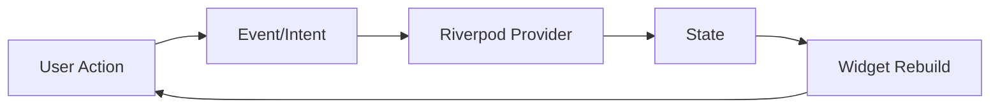
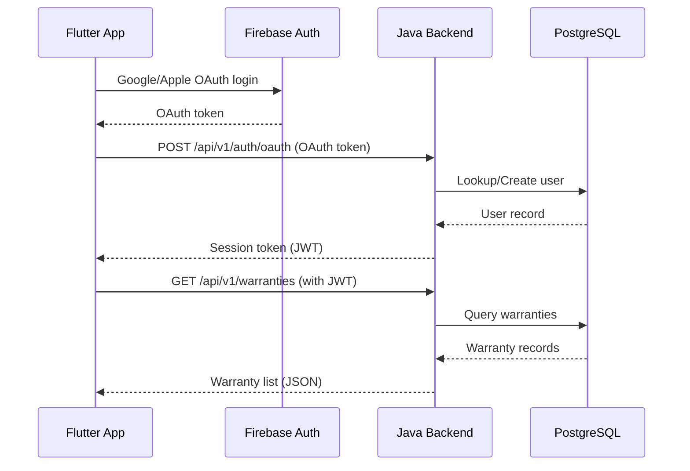
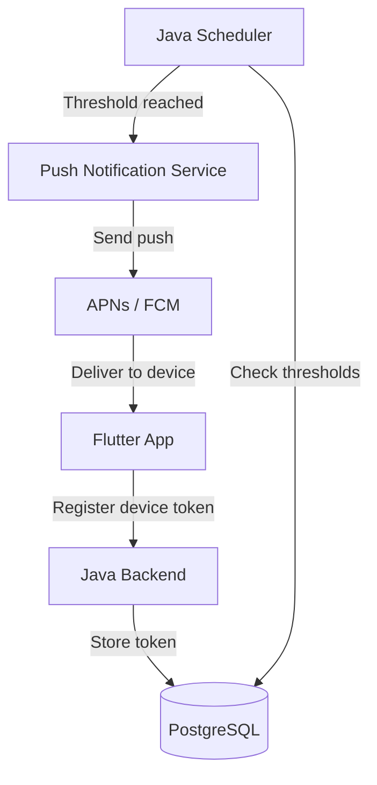

# Architecture Spine — Warranty Shield

## Design Paradigm

**Clean Architecture (layered)** — three concentric layers with dependency rule: inner layers know nothing about outer layers.

```
┌─────────────────────────────────────────────────────────────┐
│  Presentation Layer (Flutter)                               │
│  ┌───────────┐  ┌───────────┐  ┌──────────────────────────┐ │
│  │  Widgets  │→ │  Providers │→ │  State (Riverpod async) │ │
│  └───────────┘  └───────────┘  └──────────────────────────┘ │
├─────────────────────────────────────────────────────────────┤
│  Domain Layer (Dart)                                        │
│  ┌───────────┐  ┌───────────┐  ┌──────────────────────────┐ │
│  │  Entities  │  │ Use Cases │  │ Repository interfaces   │ │
│  │ (Warranty, │  │ (Create,  │  │ (abstract)              │ │
│  │  User,    │  │  Parse,   │  │                         │ │
│  │  Attach.) │  │  Sync)    │  │                         │ │
│  └───────────┘  └───────────┘  └──────────────────────────┘ │
├─────────────────────────────────────────────────────────────┤
│  Data Layer (Flutter)                                       │
│  ┌───────────┐  ┌───────────┐  ┌──────────────────────────┐ │
│  │  Remote   │  │  Local    │  │  Repository impl.       │ │
│  │  (REST)   │  │  (Hive)   │  │  (concrete)             │ │
│  └───────────┘  └───────────┘  └──────────────────────────┘ │
└─────────────────────────────────────────────────────────────┘
```

Dependency rule: **Domain knows nothing about Flutter, Java, or Firebase.** Data layer depends on Domain. Presentation depends on Data and Domain.

## Inherited Invariants

| Invariant | From | Binds here |
|-----------|------|------------|
| CAP-1 to CAP-6 (SPEC.md) | Specification contract | All capabilities must map to stories in epics.md |
| Mobile-first (iOS 15+, Android 10+) | SPEC.md NFR-1, NFR-8 | Flutter client only, no web dashboard |
| No API partnerships (MVP) | SPEC.md constraint | Firebase used for Auth + Storage only (Google services) |
| 1-minute push notification SLA | SPEC.md NFR-3 | Java backend token management |
| 30-second warranty entry | SPEC.md NFR-2 | Flutter UI + Domain logic |
| 80% email parser accuracy | SPEC.md NFR-7 | Flutter client-side parser |

## Invariants & Rules

### AD-1 — State Management

- **Binds:** All Flutter screens and widgets
- **Prevents:** Inconsistent UI state, unidirectional data flow violations
- **Rule:** All Flutter state is managed via **Riverpod** providers. No `setState`, no `ChangeNotifier` outside Riverpod. Use `asyncValue` for all async operations.



### AD-2 — Local Persistence

- **Binds:** All warranty, user, and settings data that must survive app restarts and support offline queue
- **Prevents:** Data loss on app restart, inability to queue changes offline
- **Rule:** Use **Hive** for all local persistence. Data models implement `HiveType` with explicit type adapters. Each entity has its own Hive box. No ORM layer — raw Hive API only.

### AD-3 — Dependency Injection

- **Binds:** All Flutter services, repositories, and use cases
- **Prevents:** Circular dependencies, tight coupling between layers
- **Rule:** Use **Riverpod providers** for dependency injection. No GetIt, no manual constructor wiring. Each service is a `Provider` or `Family`. Repository interfaces are provided in the Domain layer; concrete implementations are provided in the Data layer.

### AD-4 — Backend Framework

- **Binds:** CAP-1 through CAP-6 (all backend APIs)
- **Prevents:** Inconsistent API design, security gaps
- **Rule:** Use **Spring Boot** with **Spring Data JPA** and **Spring Security**. All endpoints are REST over JSON. Use Spring Scheduler for notification jobs. Version all API endpoints (`/api/v1/...`).

### AD-5 — Authentication (Hybrid)

- **Binds:** CAP-1 (Account & Authentication), CAP-7 (Account & Cloud Sync)
- **Prevents:** Inconsistent auth state across devices, security vulnerabilities
- **Rule:** **Hybrid authentication:** Google/Apple OAuth is handled in Flutter via `firebase_auth` package (client-side). Email/password authentication is handled by the Java backend REST API. After any successful auth, Flutter exchanges the OAuth token (Google/Apple) with the Java backend to receive a session token. All subsequent Flutter API calls include the session token in the `Authorization` header.



### AD-6 — Firebase Auth + Storage (Overrides "No API Partnerships")

- **Binds:** CAP-1 (OAuth), CAP-6 (Document Management)
- **Prevents:** Violating the "no API partnerships" constraint while still delivering OAuth and file storage
- **Rule:** Firebase (Google) is used for **Auth** and **Storage** only. No Firebase backend logic — no Firestore, no Cloud Functions, no Firebase ML. Firebase is a **transport and storage layer**, not a business logic partner. This is a deliberate override of the "no API partnerships" constraint justified by: (a) OAuth is a Google/Apple requirement, (b) Firebase Auth is the only supported OAuth provider for Flutter, (c) Firebase Storage is the most cost-effective object storage for an MVP.

### AD-7 — File Storage (Firebase Storage)

- **Binds:** CAP-6 (Document Management)
- **Prevents:** Backend file storage overhead, mobile upload/download inefficiency
- **Rule:** Flutter app uploads PDFs and images **directly to Firebase Storage** (bypassing Java backend). Java backend stores only the **metadata** (warranty ID, file URL, file type, upload timestamp). Flutter app downloads files directly from Firebase Storage using the URL stored in the backend. Java backend generates Firebase Storage download URLs via service account.

```mermaid
graph TD
    A[Flutter App] -->|Upload| B[Firebase Storage]
    A -->|Download| B
    A -->|Store metadata URL| C[Java Backend]
    C -->|Persist| D[(PostgreSQL)]
    B -.->|Presigned URL (via service account)| C
```

### AD-8 — Push Notification Infrastructure

- **Binds:** CAP-4 (Notifications), NFR-3 (1-minute push SLA)
- **Prevents:** Multi-device notification conflicts, missed notifications
- **Rule:** **Java backend manages all device tokens.** Flutter app sends its FCM token (Android) and APNs device token (iOS) to Java backend on login and on token refresh. Java backend stores tokens per user in PostgreSQL. When a warranty threshold is reached, Java backend sends the push notification **directly** to APNs/FCM. Flutter app does NOT schedule local push notifications for expiration alerts (it may schedule local reminders for UI purposes, but the authoritative push comes from the backend).



### AD-9 — Email Parsing (Client-Side)

- **Binds:** CAP-5 (Email Parsing), NFR-7 (80% accuracy)
- **Prevents:** Email content leaving the device, privacy violations
- **Rule:** Email parsing happens **entirely in the Flutter client**. Flutter app uses a local email parser library (e.g., `flutter_email_parser` or custom regex) to extract product name, purchase date, warranty duration, and retailer from inbox emails. Parsed data (structured objects, not raw emails) is sent to the Java backend for saving. **Raw email content never leaves the device.**

### AD-10 — Push-Triggered Sync

- **Binds:** CAP-7 (Account & Cloud Sync), NFR-6 (60-second sync)
- **Prevents:** Unnecessary polling, battery drain, stale data
- **Rule:** Java backend sends a **push notification** when any warranty is created, updated, or deleted. Upon receiving the push, Flutter app immediately fetches updated data from the Java backend REST API. No polling. No WebSockets. The push acts as a "data changed" signal; Flutter performs a full fetch of affected warranties after receiving the push.

```mermaid
graph TD
    A[Device A: Create Warranty] --> B[Java Backend]
    B -->|Persist| C[(PostgreSQL)]
    B -->|Send push| D[APNs / FCM]
    D -->|Push: "warranty updated"| E[Device B]
    E -->|GET /api/v1/warranties| B
    B -->|Updated warranty list| E
```

### AD-11 — Conflict Resolution (Last-Write-Wins)

- **Binds:** CAP-7 (Story 7.2: Real-Time Cloud Synchronization)
- **Prevents:** Silent data loss, confusing user experience
- **Rule:** Last-write-wins conflict resolution. Each warranty entity has an `updated_at` timestamp. When two devices edit the same warranty, the device with the most recent `updated_at` wins. The losing device receives a conflict notification (banner: "Your changes were overwritten by a recent edit on another device. View updated version.") and fetches the latest version.

### AD-12 — Offline Queue Strategy

- **Binds:** CAP-7 (Story 7.2: offline changes)
- **Prevents:** Data loss during connectivity gaps
- **Rule:** When Flutter app is offline, changes are queued in **Hive** (local persistence). Each queued change includes: action type (create/update/delete), warranty ID, payload, and timestamp. When connectivity is restored, Flutter app replays queued changes to the Java backend in FIFO order, then performs a full sync (per AD-10).

## Consistency Conventions

| Concern | Convention |
|---------|-----------|
| **Naming (entities, files, interfaces)** | Entities: PascalCase (`Warranty`, `User`, `Attachment`). Use cases: VerbNoun (`CreateWarranty`, `ParseEmail`, `SyncData`). Repository interfaces: `I{Name}Repository` (Java) / `abstract class {Name}Repository` (Dart). Flutter widgets: PascalCase (`WarrantyCard`, `WarrantyDetailScreen`). |
| **Data & formats (ids, dates, error shapes)** | IDs: UUID v4. Dates: ISO 8601 (`yyyy-MM-ddTHH:mm:ssZ`). Errors: `{ "code": "STRING_CODE", "message": "Human readable", "details": {} }`. Pagination: `{ "data": [], "total": 0, "page": 1, "pageSize": 20 }`. |
| **State & cross-cutting (mutation, errors, logging, config, auth)** | Auth: JWT session tokens (24-hour expiry, refresh on each request). Config: Environment variables (`.env` files). Logging: Structured JSON logs (Java: Logback, Flutter: `logger` package). Error handling: Global error handler in Flutter (Riverpod) and Spring `@ControllerAdvice` (Java). |

## Stack

| Name | Version |
|------|---------|
| Flutter | 3.24+ (Dart 3.4+) |
| Riverpod | 2.5+ |
| Hive | 2.3+ |
| Java (Spring Boot) | 3.2+ (Java 21) |
| Spring Data JPA | 3.2+ |
| Spring Security | 6.2+ |
| PostgreSQL | 16+ |
| Firebase Auth | Flutter `firebase_auth` 4.17+ |
| Firebase Storage | Flutter `firebase_storage` 11.7+ |
| APNs (Apple Push Notification) | Server-side (Java) |
| FCM (Firebase Cloud Messaging) | Server-side (Java) |

## Structural Seed

```text
warranty-tracker/
├── mobile/                    # Flutter client
│   ├── lib/
│   │   ├── main.dart
│   │   ├── app/               # App-level providers, theme, routing
│   │   ├── features/          # Feature modules (one per epic)
│   │   │   ├── auth/
│   │   │   │   ├── auth_screen.dart
│   │   │   │   └── auth_provider.dart
│   │   │   ├── warranties/
│   │   │   │   ├── warranty_list_screen.dart
│   │   │   │   ├── warranty_detail_screen.dart
│   │   │   │   ├── warranty_entry_screen.dart
│   │   │   │   ├── warranty_provider.dart
│   │   │   │   └── warranty_repository.dart
│   │   │   ├── notifications/
│   │   │   ├── email_import/
│   │   │   └── attachments/
│   │   ├── domain/            # Use cases, entities, repository interfaces
│   │   │   ├── entities/
│   │   │   ├── use_cases/
│   │   │   └── repositories/
│   │   └── data/              # Repository implementations, Hive adapters, remote API
│   └── pubspec.yaml
├── backend/                   # Java Spring Boot server
│   ├── src/main/java/com/warranty/
│   │   ├── config/            # Security, scheduling, Firebase config
│   │   ├── controllers/       # REST controllers
│   │   ├── services/          # Business logic
│   │   ├── repositories/      # Spring Data JPA repositories
│   │   ├── models/            # JPA entities
│   │   └── dtos/              # Request/Response DTOs
│   └── pom.xml
└── docs/
    └── specs/
    └── planning-artifacts/
```

## Capability → Architecture Map

| Capability / Area | Lives in | Governed by |
|-------------------|----------|-------------|
| CAP-1: Account & Auth | Flutter (auth feature) + Java (auth controller) | AD-5, AD-6 |
| CAP-2: Warranty Entry | Flutter (warranties feature) + Java (warranties controller) | AD-1, AD-4 |
| CAP-3: Dashboard & Views | Flutter (warranties feature) | AD-1 |
| CAP-4: Notifications | Java (scheduler, push service) + Flutter (notification display) | AD-8 |
| CAP-5: Email Parsing | Flutter (email_import feature) | AD-9 |
| CAP-6: Document Management | Flutter (attachments feature) + Firebase Storage | AD-7 |
| CAP-7: Account & Sync | Flutter (data layer, Hive) + Java (REST API) | AD-10, AD-11, AD-12 |

## Deferred

| Decision | Reason it can wait | Revisit condition |
|----------|-------------------|-------------------|
| Specific Flutter UI component library (e.g., cupertino vs material) | Material 3 is the default and sufficient for MVP | When UX designer specifies design system |
| Exact Hive type IDs for each entity | Trivial to change; no cross-module impact | When data migration is needed |
| CI/CD pipeline (Java backend + Flutter) | Not needed for initial development | When first deployment is planned |
| Monitoring / observability (APM, logging aggregation) | Not needed for MVP | When production deployment is planned |
| Database indexing strategy | Can be optimized post-launch | When performance testing reveals slow queries |
| Flutter app size optimization (tree shaking, code splitting) | Not needed for initial development | When app bundle size exceeds 15MB |
| Firebase Storage security rules | Can be configured at deployment time | Before production deployment |
| Java backend load balancing / scaling strategy | On-prem single instance is sufficient for MVP | When concurrent users exceed 100 |
